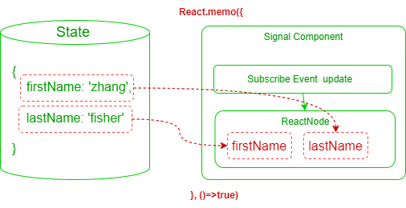
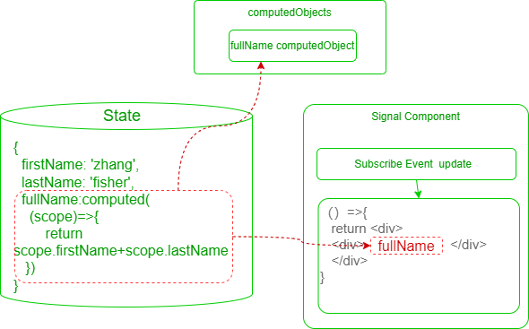

# Signal component
## about

 `AutoStore` be available `$` or `signal` create signal components.
Support multiple ways to create signal components, and functions of creating signal components `$` or `signal` the signature is as follows:

```ts
interface SignalComponentType<State extends Dict>{
    // 封装单个状态数据
    (selector: string,options?:SignalComponentOptions):React.ReactNode
    // 封装组合多个状态数据
    (selector: (state:ComputedState<State>)=>React.ReactNode,
        options?:SignalComponentOptions
    ):React.ReactNode
    // 自定义渲染函数
    <Value=any>(render:SignalComponentRender,
        path:string | string[],
        options?:SignalComponentOptions
    ):React.ReactNode
    // 自定义渲染函数,且动态创建计算属性
    <Value=any, Scope=any >(render:SignalComponentRender,
        getter:AsyncComputedGetter<Value,Scope>,
        options?:SignalComponentOptions
    ):React.ReactNode
    <Value=any, Scope=any >(render:SignalComponentRender,
        getter:ComputedGetter<Value,Scope>,
        options?:SignalComponentOptions
    ):React.ReactNode
    <Value=any, Scope=any >(render:SignalComponentRender,
        builder: ObserverDescriptorBuilder<string,Value,Scope>,
        options?:SignalComponentOptions
    ):React.ReactNode;
}
```

 `AutoStore` support very flexible signal component creation methods.

## Packaged single state

The upcoming single state data is directly encapsulated into a signal component, which is the simplest way to create a signal component.

  


## Combine multiple states

The combination of multiple status data is created as a signal component.

  


## Custom rendering

Provide custom rendering functions to control status data more complex appearance or style control.

  


## Dynamic calculation signal component

No need to be in advance `State` declarse the calculation attribute, create the calculation attribute dynamically, and then use the computing attribute object (`computedObject`) The package is a signal component.

  

- Due to the calculation attribute object (`computedObject`) Support rich features, especially asynchronous computing attributes, support `retry`,`timeout`,`loading`,`error` equilities, so signal components can have a richer expressive function.
- use `$(render,ObserverDescriptorBuilder)` method to calculate the attribute object (`computedObject`) The package is a signal component. The signature of the creation function is as follows:


```ts
<Value=any, Scope=any >(render:SignalComponentRender,
    getter:AsyncComputedGetter<Value,Scope>,
    options?:SignalComponentOptions
):React.ReactNode
<Value=any, Scope=any >(render:SignalComponentRender,
    getter:ComputedGetter<Value,Scope>,
    options?:SignalComponentOptions
):React.ReactNode
<Value=any, Scope=any >(render:SignalComponentRender,
    builder: ObserverDescriptorBuilder<string,Value,Scope>,
    options?:SignalComponentOptions
):React.ReactNode;
```

::: info reminder
Reading earlier [Calculation property](/guide/computed/about) chapters to understand the basic concept of calculating attributes.
:::

## Surveying signal component

The object of listening to the attribute (`watchObject`) The package is a signal component.

  

:::warning reminder
 `watch` and `computed` all `AutoStore` medium `ObserverObject` the subclass, but the function is different.
Reading before [Listening attribute](/guide/watch/about) chapters to understand the basic concepts of monitoring attributes.
:::
