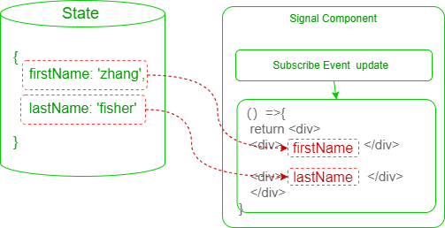

# Custom rendering
## introduce

The function of the status data into a signal component is relatively simple before, so it also provides a custom rendering function. You can perform a more complex appearance or style control when packaging status data packaging as a signal component, and return one to a one.`ReactNode` type components.

  

Can **Specify the custom rendering function when the status data is directly encapsulated as a signal component** the method function signature is as follows:

```ts
interface SignalComponentType<State extends Dict>{
    <Value=any>(
      render:SignalComponentRender,    // 渲染函数
      path:string | string[],           // 状态数据路径,
      options?:SignalComponentOptions
    ):React.ReactNode 
}
```

Custom rendering function `SignalComponentRender` the statement is as follows:

```ts
type SignalComponentRenderArgs<Value=any> = AsyncComputedValue<Value>
type SignalComponentRender<Value=any> =(
  value:SignalComponentRenderArgs<Value>
)=>React.ReactNode
```

 **The example is as follows:** 

```ts
$(
    // 渲染函数
    ({value,loading,timeout,retry,progress,error})=>{
      return <div>{value}</div>
    },
    // 状态数据的路径
    'user.age'
  )
```
If it is a state pointing to an asynchronous calculation object `AsyncComputedValue`, Will be introduced in `loading`,`timeout`,`retry`,`progress`,`error` waiting for parameters, so we can perform more rendering control.


## Status signal component

In the previous article, we use `$ ('<State Path>')` will **Status data is directly encapsulated as signal components**, But lack more control, you can also specify a custom rendering function at this time.

```tsx 
<Value=any>(render:SignalComponentRender,path:string | string[]):React.ReactNode
```

Will **Status data is directly encapsulated as signal components** the method of specifying a custom rendering function is as follows:

```ts  {3-5,7}
$(
    // 渲染函数
    ({value})=>{
      return <div>{value}</div>
    },
    // 状态数据的路径
    'user.age'
  )
```

The following is one `$ (Render, '<State Path>')` example of custom rendering function:

<demo react ="signals/signalCustomRender.tsx"/>


## Asynchronous state signal component

If the status data path is directed to an asynchronous computing object `AsyncComputedValue` at that time, the object contains `loading`,`error`,`value` properties.

Support for use at this time `$ ('<Tiles of asynchronous calculation attributes>')` create a signal component.
 
<demo react ="signals/signalAsyncCustomRender.tsx"/>
 

:::warning reminder
 `$('order.count')` and `$('order.total.value')` it is equivalent. When creating a signal component, if the target is found `AsyncComputedValue` automatically add `value`.
:::
 

## Advanced asynchronous signal component

If the target path is an asynchronous calculation attribute, the same one is also used `$(<render>,<path>)` the method of customizing the rendering, but the parameters of the rendering function at this time are an object `AsyncComputedValue` including `value`,`loading`,`error`,`timeout`,`retry` properties.

Therefore, we can follow `loading`,`error` for more attributes, more custom rendering control.

<demo react ="signals/signalAsyncCustomRenderPro.tsx"/>