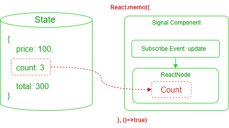

# Status signal component
## about

The state data is encapsulated into a signal component. When the state data changes, the redirect component is automatically rendered.

  ```ts 
interface SignalComponentType<State extends Dict>{
    // 指定状态数据路径
    (selector: string):React.ReactNode   
    // 返回状态数据的函数
    (selector: (state:ComputedState<State>)=>React.ReactNode):React.ReactNode 
}
```

::: info prompt
You only need to specify the path of the status digital library or provide a function that returns the status data.
:::


## Synchronous signal component

use `$ ('<State Path>')` will **Status data is directly encapsulated as signal components** when the status data changes, the re -rendering of the signal component is automatically triggered.

<demo react ="signals/signalStateBase.tsx"/>

:::warning Note
Be updated `Age` at the same time, the entire color block will not change to re -renders.
:::

## Combination synchronous signal component

use `$((state)=>{.....})` the combination of multiple status data is created as a signal component. When the dependent state data changes, the signal component will automatically trigger re -rendering.

<demo react ="signals/signalComboState.tsx"/>

## Asynchronous computing signal component

Use `$ ('<State Path>')` will **Status data is directly encapsulated as signal components** at this time, if the status data is an asynchronous data object `AsyncComputedValue` at that time, the object contains `loading`,`error`,`value` properties.
 
<demo react ="signals/signalAsyncState.tsx"/>
 

- When the path specifies an asynchronous computing attribute, the signal component created will automatically add `value` property. Therefore, the above `$('order.total')` and `$('order.total.value')` it's equivalent.


:::warning Note
- `$('order.count')` and `$('order.total.value')` it is equivalent. When creating a signal component, if the target is found `AsyncComputedValue` automatically add `value`.
- You may have noticed that the rendering color block components on the current page will not change. This is the charm of the fine particle -level update of the signal component. When the state changes, the rendering of the component is limited inside the signal component.
:::