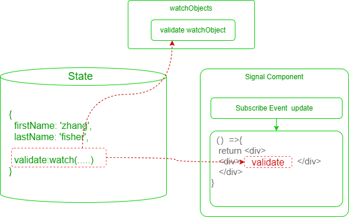

# Surveying signal component
:::warning title
Please understand first when reading this section `computed` and `watch` chapter.
:::

## about

Calculating signal component is will `computedObject` package into a signal component, should `computedObject` when the state data changes, the re -rendering of the signal component is automatically triggered.
The monitoring signal component is `watchObject` package into a signal component, should `watchObject` when the state data changes, the re -rendering of the signal component is automatically triggered.

  

 **The method function signature is as follows:** 

```ts
interface SignalComponentType<State extends Dict>{
    <Value=any, Scope=any >(render:SignalComponentRender,getter:AsyncComputedGetter<Value,Scope>):React.ReactNode
    <Value=any, Scope=any >(render:SignalComponentRender,getter:ComputedGetter<Value,Scope>):React.ReactNode
    <Value=any, Scope=any >(render:SignalComponentRender,builder: ObserverDescriptorBuilder<string,Value,Scope>):React.ReactNode;
}
```## Surveying signal component

How to calculate the signal component is right `computed` the package, the monitoring signal component can be realized `watch` packaging.

```ts  {3-5,7-9}
$<any>( 
    ({value})=>{
      return <div>{value}</div>
    },
    watch(({path,value},watchObj)=>{
      return xxxx
    })
) 
```
 

The following is an example of a monitoring signal component:
  
<demo react ="signals/signalWatch.tsx"/>


- In the previous example, we use `watch` come to create a monitoring signal dynamically.
- In the state `validate` when changing, we calculate the effectiveness of the entire state, and then write the results of the effectiveness `validate` in this way, the re -rendering of the monitoring signal component is triggered.
