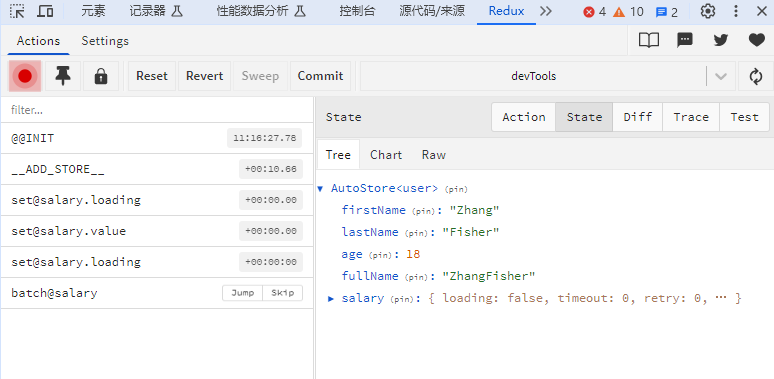

# 快速入门

`AutoStore`功能强大，易于使用。以下通过构建一个简单书店商城的例子来展示如何使用`AutoStore`，体验`AutoStore`极致优雅和强大的功能。

## 第1步: 安装

:::code-group

```bash [npm]
npm install  @autostorejs/react
npm install @autostorejs/devtools
```

```bash [yarn]
yarn add @autostorejs/react
yarn add @autostorejs/devtools
```

```bash [pnpm]
pnpm add @autostorejs/react
pnpm add @autostorejs/devtools
``` 
:::

安装`@autostorejs/devtools`可以让开发者使用`chrome`的[Redux DevTools Extension](https://github.com/reduxjs/redux-devtools)来调试`AutoStore`的状态。

## 第2步: 创建Store

使用`createStore`来创建一个`Store`。

```ts
import { createStore } from '@autostorejs/react';

const store = createStore({
  orders: [
    {
      book: 'AutoStore最佳实践',
      price: 39.9,
      count: 1 
    }
  ] 
});
```

- 通过`store.state`可以访问状态树，自动进行类型推断。


## 第3步: 创建计算属性

接下为，我们需要计算订单的`小结`和`总计`，只需要使用同步计算即可。

```ts {9-10,13-14}
import { createStore } from '@autostorejs/react';

const store = createStore({
  orders: [
    {
      book: 'AutoStore最佳实践',
      price: 39.9,
      count: 1,
      // 小计
      total: (order)=>order.price*order.count
    }
  ],
  // 总计
  total: (scope)=>scope.orders.reduce((acc,cur)=>acc+cur.total,0)

});
```


- `total`是一个计算属性，其值是`orders`的`total`的和，在创建时会自动收集依赖，当`price`或`count`变化时会自动重新计算。
- `total`计算属性的第一个参数`scope`默认是指向所在的对象，因此`(order)=>order.price*order.count`就可能计算出`total`的值，然后写入`store.state.orders.[index].total`。

**运行效果如下：**

<demo react="get-started/createComputed.tsx"/>
 

## 第4步: 创建异步计算属性

接下我们为订单增加一个`折扣(discount)`字段。

订单的折扣是动态的，其计算很复杂，由后台的业务逻辑决定，可能会根据订单的数量、种类、时间、用户是否是VIP等来决定，因此我们设计`折扣(discount)`字段为一个异步计算属性。

```ts
import { createStore } from '@autostorejs/react';

const store = createStore({
  orders: [
    {
      book: 'AutoStore最佳实践',
      price: 39.9,
      count: 1,
      // 小计
      total: (scope)=>scope.price*scope.count
    }
  ],
  //  折扣： 向后台请求折扣
  discount: computed(async (scope)=>{   // [!code ++]
    // 如await fetch(`/api/discount?userId=1&total=${scope.total}....`) // [!code ++]
    await delay(2000)// [!code ++]
    return  (0.5 + Math.random()).toFixed(2)// [!code ++]
  },['orders.*.total'],{async:true,initial:0.9}),// [!code ++]
  // 总计
  total: computed(async (scope)=>{ 
    return scope.orders.reduce((acc,cur)=>acc+cur.total,0)*scope.discount.value
  },['discount'],{async:true})  

});
```

**注意**： 

- `discount`是一个异步计算属性，其计算函数是一个异步函数，其返回值会写入`store.state.discount`，这就是`AutoStore`与其他状态库最大不同之处，即**原地计算**。


**运行效果如下：**

 <demo react="get-started/asyncDiscount.tsx"/>
 

在以上示例中，我们声明了两个异步计算属性`discount`和`total`

- `discount`依赖`orders.*.total`，即依赖了`orders`数组中的`total`属性。当订单的数量变化时，触发`discount`的计算函数，计算函数会向后台请求折扣，然后返回新的折扣值。(在上例中，我们模拟请求折扣的过程，使用了`delay`函数，实际项目中，我们可能会使用`fetch`或`axios`等来请求折扣)。
- `total`则依赖`discount`，即依赖了`discount`的值。当`discount`变化时，触发`total`的计算函数，重新计算总计。

 
:::warning 注意
上例中异步计算`discount`需要`2000ms`才可以看到`discount`和`total`的变化。期间界面没有任何变化，显然这是不友好的。一般最好是在计算折扣过程中时，显示一个`loading`状态，告诉用户正在请求折扣。当折扣请求完成时，再显示折扣值。
因此， `AutoStore`提供了`loading`、`error`、`timeout`、`retry`、`cancel`、`progress`等高级功能。
:::


## 第5步: 控制异步计算

在上一步中，当我们调节订单数量`count`时，需要`2000ms`才可以看到`discount`和`total`的变化。期间界面没有任何变化，显然这是不友好的，我们需要在请求折扣时，显示一个`loading`状态，告诉用户正在请求折扣。当折扣请求完成时，再显示折扣值。

这时，我们就可以开始引入`异步计算`的各种高级功能。**让我们先在计算时显示`loading`状态。**

与同步计算属性相比，创建异步计算属性`discount`时，会转换为一个`AsyncComputedValue`对象回写到`state.state.discount`，此时访问`state.state.discount`，其值如下:

```ts
{
    loading : false,
    progress: 0,  
    timeout : 0,  
    error  : null,
    retry : 0,  
    value: 0.9,        // [!code warning]
    run:()=>{...}
}
```

也就是说，任何异步计算属性，均会有一个`loading`字段，当计算函数运行时，`loading`为`true`，当计算函数运行完成时，`loading`为`false`。

因此，在本例中，我们可以通过`discount.loading`来判断是否正在请求折扣，如果是，则显示`loading`状态。

**运行效果如下：**

<demo 
  react="get-started/asyncDiscountLoading.tsx"
  title="请调节订单数量"
/>

调节订单数量时，可以看到`discount`和`total`的变化，同时显示了`loading`状态。当折扣请求完成时，`loading`状态消失，显示折扣值。

一切都如预期工作。当然，实际项目只显示`loading`状态是不够的，一般我们还需要增加以下功能：
- **超时处理**：向服务器请求折扣可能会出错。
- **倒计时**: 可能我们想显示一个倒计时，告诉用户还有多久请求完成。
- **重试机制**：如果请求折扣失败，我们可能会重试请求。
- **错误处理**：如果请求折扣失败，我们需要显示错误信息。
- **可取消**：如果用户取消了订单，我们需要取消请求。
- **处理进度**：可能我们想提供一个请求进度`0-100%`，告诉用户请求进度。

所有这些功能`AutoStore`均为你准备好了，开箱即用，简单快捷，详见[异步计算](/guide/computed/async)

## 第6步: 增加订单

以上我们只有一条订单，接下来我们增加多条订单，看看`AutoStore`是如何处理多条订单的。

1. 首先使用`useForm`创建一个表单用来收集用户输入。

```tsx
  const { state:newOrder, Form:NewOrderForm } = useForm({
      book:'精通AutoStore',
      price:10,
      count:1 
  })   
```

- `useForm`内部也创建了一个`AutoStore`用来保存新订单的数据。

2. 使用`store.state.orders.push`将新订单添加到`orders`数组中。

```tsx
  <Button onClick={()=>{
    store.state.orders.push({
      ...newOrder,
      total:calcOrderTotal
    })
  }}>Add</Button>
```


**运行效果如下：**

<demo react="get-started/addOrder.tsx"/>


:::warning
`AutoStore`提供了非常强大的表单双向绑定能力，详见[表单绑定](/guide/form/about)查看更多内容.
:::

## 第7步: 调试与诊断

在开发与调试过程中，`AutoStore`支持使用[Redux DevTools Extension](https://github.com/reduxjs/redux-devtools)来调试`AutoStore`的状态。

只需要在你的项目的最开始处导入`@autostorejs/devtools`，然后配置`{debug:true}`即可。

```ts {3,7,8}
//main.ts | app.ts | index.ts

import `@autostorejs/devtools`

// 创建store时，配置debug:true
const store = createStore({...},{
  debug:true,
  id:"user"   // 配置id便以在devTools中显示
})

```

使用效果如下：




## 小结

- 使用`createStore`或`useStore`可以创建任意嵌套的响应式状态对象。
- 在组件中使用`useReactive`可以访问状态数据，并在状态变化时自动重新渲染。
- 使用`$('状态路径')`可以创建一个信号组件，将渲染更新限制在较细的范围内。
- 使用`computed`可以创建一个计算属性，其值是根据其他状态计算而来，当依赖状态变化时，会自动重新计算。
- 异步计算支持`loading`、`error`、`timeout`、`retry`、`cancel`、`progress`等高级功能。
- `useForm`可以将表单元素与`store`双向绑定，非常方便。
